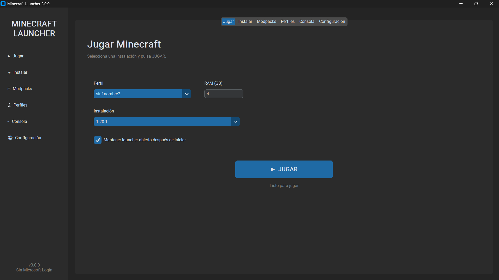
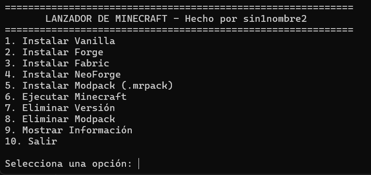

# **🚀 Lanzador de Minecraft - Python Offline Edition (v3.0.0)**

Un lanzador moderno, ligero y completo para Minecraft desarrollado en Python utilizando **CustomTkinter** y **minecraft-launcher-lib**. Permite instalar versiones Vanilla, Forge, Fabric, NeoForge y modpacks (.mrpack), además de gestionar perfiles offline, configurar Java/RAM, monitorear la consola en tiempo real y ejecutar el juego fácilmente.


---

## **📸 Galería**





---

## **✨ Características:**

🧼 **Interfaz gráfica moderna:** Diseño limpio en modo oscuro (*Dark Mode*) con sistema de pestañas (*Jugar, Instalar, Modpacks, Perfiles, Consola, Configuración*).

📦 **Soporte Multi-cargador de Mods:**
- 🌿 **Minecraft Vanilla:** Descarga e instalación de versiones oficiales.
- 🛠️ **Forge:** Instalación automática de Forge para versiones compatibles.
- 🧵 **Fabric:** Soporte e instalación directa de Fabric Loader.
- 🦊 **NeoForge:** Instalación de NeoForge de forma sencilla.
- 🧩 **Modpacks (.mrpack):** Importación e instalación completa de modpacks descargados de Modrinth.

👤 **Gestión de Perfiles Offline:**
- Creación y eliminación de perfiles locales.
- Generación automática de UUIDs locales.
- Alternancia rápida entre distintos usuarios sin necesidad de re-iniciar sesión.

☕ **Detección y Selección de Java:**
- Buscador automático de ejecutable Java en el sistema y variable `JAVA_HOME`.
- Menú para seleccionar manualmente la versión de Java deseada.
- Muestra la versión detectada de Java en tiempo real.

▶️ **Lanzamiento y Ejecución Personalizada:**
- Configuración de memoria RAM dedicada (GB).
- Opción para mantener el lanzador abierto o cerrarlo tras iniciar el juego.
- Redirección automática de instancias de modpacks a sus carpetas independientes.

⌁ **Consola de Logs en Tiempo Real:**
- Salida directa de logs de Minecraft dentro del launcher para identificar crashes o errores de mods.
- Botón para limpiar consola.

🗑️ **Gestión y Limpieza Segura:**
- Eliminación directa y segura de versiones instaladas.
- Borrado completo de carpetas de modpacks e instancias.
- Acceso directo a la carpeta de cada modpack desde la interfaz.

☁️ **Consultas en Línea:**
- Visor para consultar las versiones disponibles oficialmente en Mojang.

⚠️ **Manejo de Errores y Seguridad:**
- Verificación interna de rutas para evitar borrados accidentales fuera del directorio del launcher (`is_safe_child`).
- Guardado atómico de archivos de configuración JSON mediante archivos temporales `.tmp`.

---

## **📋 Requisitos**

- **Python:** 3.8 o superior.
- **Java:** Java 8, 17 o 21 instalado (necesario para ejecutar las distintas versiones de Minecraft).
- **Conexión a Internet:** Requerida únicamente para la descarga inicial de versiones, cargadores de mods y modpacks.

---

## **⚙️ Instalación**

### **1. Clonar el repositorio**

```bash
git clone [https://github.com/sin1nombre2/minecraft_launcher.git](https://github.com/sin1nombre2/minecraft_launcher.git)
2. Entrar a la carpeta del proyecto
Bash
cd minecraft_launcher
3. Instalar dependencias
Bash
pip install customtkinter minecraft-launcher-lib
(O si utilizas el archivo de requerimientos):

Bash
pip install -r requirements.txt
▶️ Uso
Ejecuta la interfaz principal del launcher:

Bash
python launcher.py
📁 Estructura del proyecto
Plaintext
minecraft_launcher/
│
├── launcher.py               # Código fuente principal con interfaz CustomTkinter
├── README.md                 # Documentación del proyecto
├── requirements.txt           # Dependencias del proyecto
│
└── assets/                   # Recursos visuales del repositorio
    ├── Captura_interfaz.png
    └── Captura_consola.png
⚠️ Notas importantes:
Modo Offline: El launcher funciona exclusivamente en modo offline/local; no requiere ni almacena credenciales de cuentas Microsoft.

Rutas de instalación por defecto (se crean automáticamente):

Windows: C:\Users\TuUsuario\AppData\Roaming\.launchermc

macOS: ~/Library/Application Support/.launchermc

Linux: ~/.launchermc

Recomendación de RAM: Se recomiendan al menos 4 GB de RAM para un rendimiento fluido con mods o modpacks.

Actualización de listas: La lista de versiones instaladas y modpacks se actualiza automáticamente al agregar o eliminar contenido.

🛠️ Mejoras futuras:
🔐 Soporte para autenticación oficial con cuentas Microsoft (Login Premium).

🔄 Buscador e instalador directo de modpacks desde la API de Modrinth/CurseForge.

🎨 Personalización de temas visuales y fondos del launcher.

🤝 Contribuciones
¡Las contribuciones son más que bienvenidas! 🙌

Si encuentras un error o tienes ideas para mejorar el launcher, puedes:

Abrir un Issue.

Crear un Pull Request.

📄 Licencia
Este proyecto es de código abierto. Puedes usarlo, modificarlo y mejorarlo libremente.

❤️ Autor
Hecho con ❤️ por Sin1Nombre2